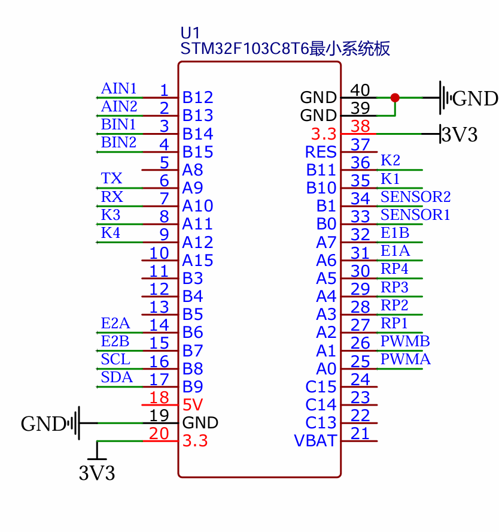
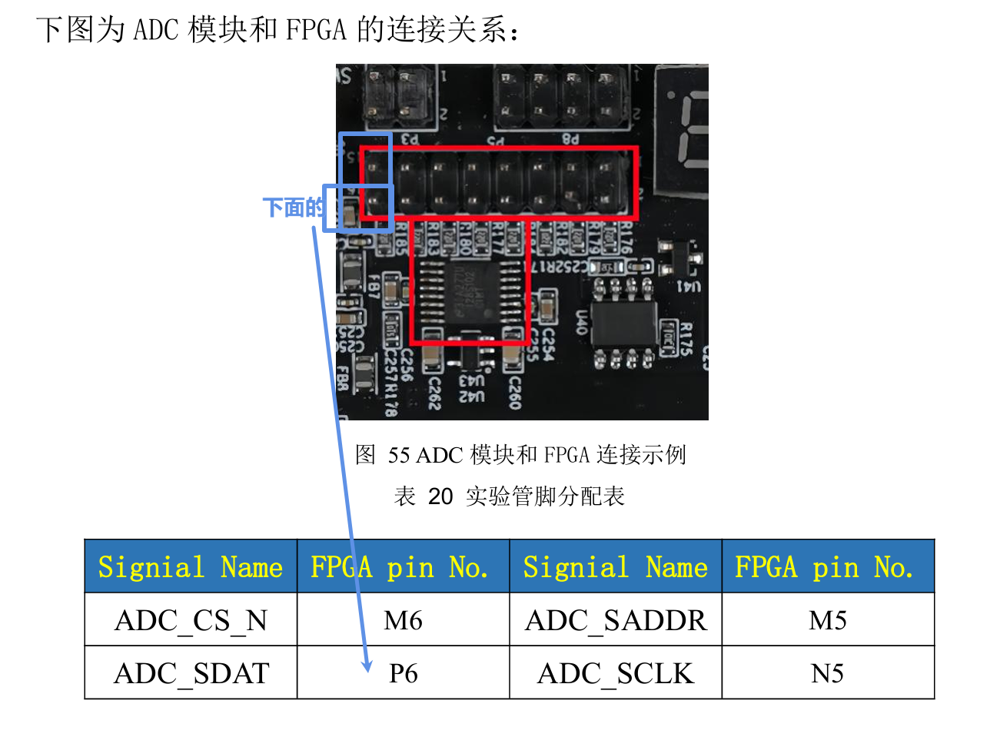
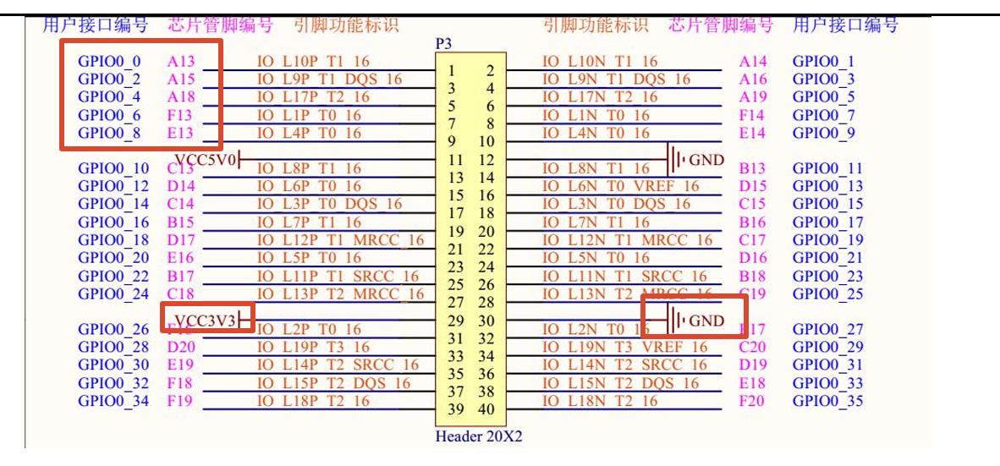

# PCB-FPGA引脚接线

| PCB丝印 |   FPGA引脚   |       PCB丝印备注        |
| :-----: | :----------: | :----------------------: |
|   PA6   |  A13(GPIO0)  |           E1A            |
|   PA7   |  A15(GPIO2)  |           E1B            |
|  PB12   |  A18(GPIO4)  |           AIN1           |
|  PB13   |  F13(GPIO6)  |           AIN2           |
|   PA0   |  E13(GPIO8)  |           PWMA           |
|   PB0   | P6(ADC_DOUT) |         SENEOR1          |
|   GND   |     GND      | 只需要连接GND，不要连3V3 |

+ PCB：

+ FPGA

